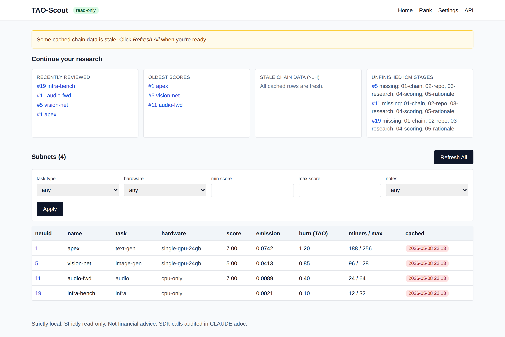
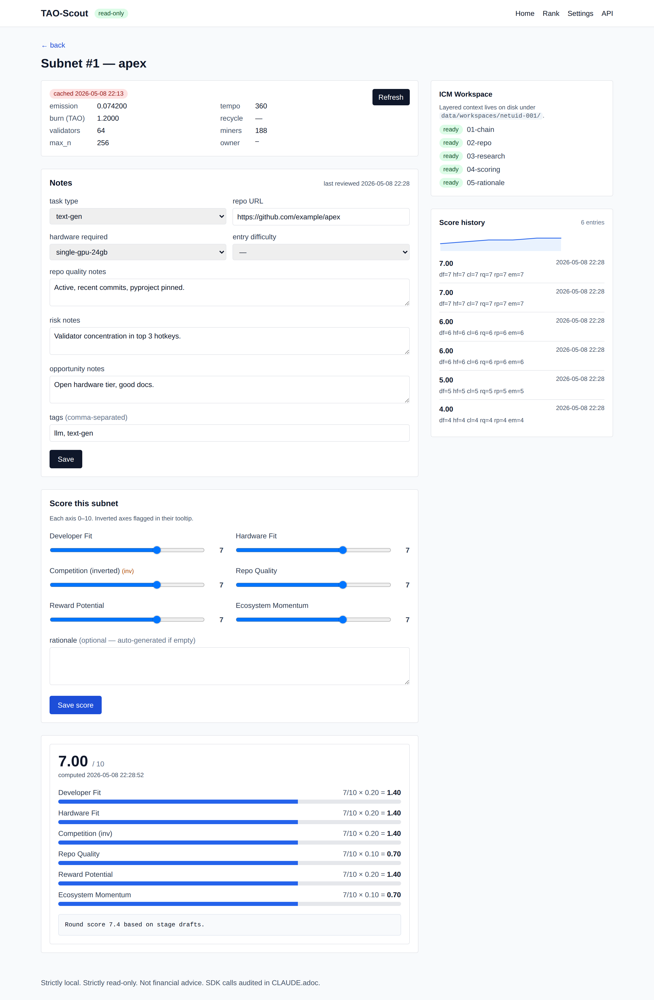
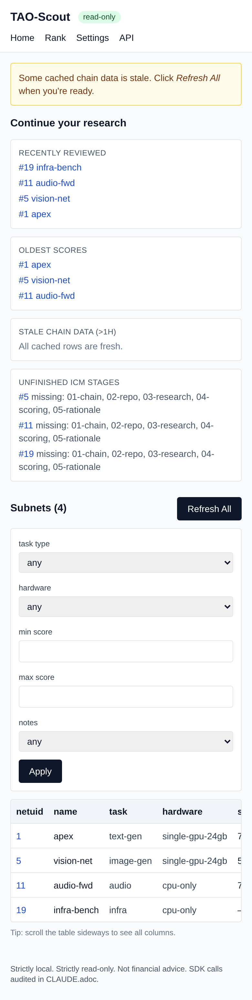
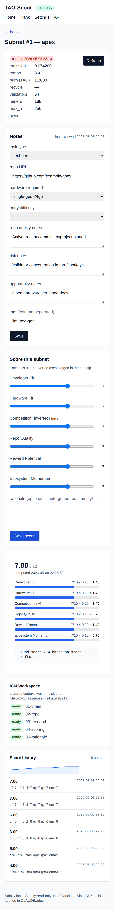

= TAO-Scout
:toc: macro
:icons: font
:source-highlighter: rouge
:experimental:

[NOTE]
====
*Strictly local. Strictly read-only.* This is not a wallet, not a trading
tool, and not financial advice. TAO-Scout never creates, imports, or signs
keys, and never submits extrinsics. See `CLAUDE.adoc` for the audited list
of allowed SDK calls.
====

TAO-Scout is a research tool that answers, for any Bittensor subnet:

> "Should I spend the next 30 days building for this subnet?"

It pairs *objective on-chain data* (cached, refreshable, auditable) with
*subjective developer notes* and a *transparent weighted scoring model* on
six axes. Output is *insight*, not transactions.

toc::[]

== Quick start

[source,bash]
----
git clone <this repo>
cd Crypt

uv venv --python 3.11 .venv
uv pip install -e ".[dev]"
.venv/bin/alembic upgrade head
.venv/bin/tao-scout doctor    # verifies SDK / RPC / DB
.venv/bin/tao-scout serve     # foreground web UI on http://127.0.0.1:8765
----

In a separate shell, populate the cache:

[source,bash]
----
.venv/bin/tao-scout refresh --all
.venv/bin/tao-scout list
----

== Screenshots

Home page with the "Continue your research" rail and the filterable
subnets table:

The detail page pairs cached chain metrics with the notes editor, the
six-axis scoring form, and a server-rendered SVG sparkline of the score
history:

The same pages stack cleanly on a phone:

To regenerate:

[source,bash]
----
.venv/bin/python -m pip install playwright   # or `uv pip install playwright`
.venv/bin/playwright install chromium
.venv/bin/python scripts/take_screenshots.py
----

If your environment blocks outbound HTTPS from the Chromium sandbox
(common in CI / dev containers), pre-cache the three CDN scripts first:

[source,bash]
----
mkdir -p docs/screenshots/.cache
curl -sL https://cdn.tailwindcss.com/3.4.17 -o docs/screenshots/.cache/tailwind.js
curl -sL https://unpkg.com/htmx.org@1.9.12 -o docs/screenshots/.cache/htmx.js
curl -sL https://unpkg.com/alpinejs@3.x.x/dist/cdn.min.js -o docs/screenshots/.cache/alpine.js
----

== Features

* Read-only async chain client (`AsyncSubtensor`) with timeouts and graceful
  fallbacks. Every SDK attribute is checked against an allow-list *and* a
  deny-list before any network I/O.
* SQLite cache: chain reads are persisted; UI shows stale-flag banners
  rather than substituting zeros.
* HTMX-driven web UI -- no build step, no npm. Tailwind via CDN.
* Six-axis scoring with append-only history and an editable weights vector
  (sum must equal 1.0).
* "Continue your research" rail on the home page: recently reviewed subnets,
  oldest scores, stale chain rows, unfinished ICM stages.
* Per-subnet *Interpreted Context Methodology* workspace under
  `data/workspaces/netuid-NNN/` with five staged folders, each containing a
  `CONTEXT.adoc` declaring its Inputs, Process, and Outputs.
* Symmetrical CLI (`tao-scout`) and HTTP API; both share one service layer.
* Export / import as JSON or CSV (CLI + web). Round-trip is lossless for
  JSON.
* `tao-scout snapshot` records the cached chain row + current note + latest
  score into the `snapshots` table for later diffing.

== Architecture

[source]
----
+--------------+       +---------------+        +---------------+
|  Typer CLI   |  -->  | services.py   | <----+ |  FastAPI API  |
+--------------+       +-------+-------+      | +-------+-------+
                               |              |         |
                               v              |         v
                       +-------+-------+      |  +-------+-------+
                       |  scoring/     |      |  | web/ (HTMX)   |
                       |  cache (db)   |      |  | templates     |
                       +-------+-------+      |  +---------------+
                               |              |
                               v              |
                    +----------+-----------+  |
                    | chain.client (RO)    +--+
                    | + safety.py guard    |
                    +----------------------+
----

== Read-only enforcement

The single source of truth is `src/tao_scout/safety.py`:

* `FORBIDDEN_SDK_METHODS` -- a deny-list of write/sign/key methods that
  raise `ReadOnlyViolationError` if invoked.
* `find_forbidden_wallet_imports(...)` -- AST scan of `src/` that fails the
  build if any wallet/Keypair import sneaks in.
* `Settings.read_only = True` is `frozen=True` and validates True on init;
  no env var can flip it.
* `chain/client.py` keeps a separate `ALLOWED_SDK_METHODS` allow-list. Both
  checks must pass for an SDK call to proceed.

`tao-scout doctor` reports each invariant separately so a mis-configured
install is obvious.

== Project layout

See `ROADMAP.adoc` for milestones and `CLAUDE.adoc` for the persistent
project conventions and SDK audit list.

== License

MIT.
